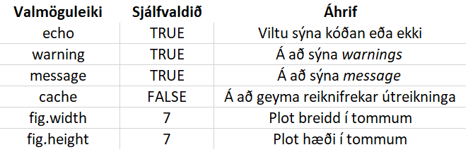

```{r setup, include=FALSE}
knitr::opts_chunk$set(echo = TRUE, message = FALSE, warning = FALSE, fig.height = 3)
```

Inngangstexti

# Efni námskeiðsins

Efni námskeiðins skiptist í fjóra flokka eftir dögum.

1. Inngangur að R og RMarkdown
2. Gagnavinnsla með dplyr pakkanum og myndræn framsetning með ggplot2 pakkanum
3. Lestur gagna og notkun tidyr pakkans til að koma gögnum á tidy-format
4. Notkun stýrisetningar (if-else), for loop, tímasetja script og, ef tími gefst, helstu föll úr purrr pakkanum


# Tími 1

Lærum að vinna með útreikninga í R og fáum góða tilfinningu fyrir R. Búum til breytur og lærum að vinna með mismunandi tegundir breyta. Áttum okkur á *working directory*, *relative path* og *absolute path*. Lærum að lesa inn gögn úr m.a. úr CSV og Excel.

## RStudio og R
R er 25 ára gamalt forritunarmál hannað fyrir tölfræðivinnslu. Í dag er R eitt mest notaðasta forritið þegar kemur að gagnavísindum (e. data science). Þó R sé eitt vinsælasta forritið opna mjög fáir R með beinum hætti. Langflestir styðjast við RStudio sem keyrir R í bakgrunn. Þannig er ekki hægt að nota RStudio nema vera með R uppsett á tölvunni. Þó næstum allir opni ávalt RStudio er samt talað um að vera R forritari eða kunna á R. Það er aldrei talað um að forrita í RStudio.

### RStudio stillingar

1. Sýna hvernig eigi að búa til project
  - Existing directory eða new
2. working directory
3. Opna Global options
  - Haka af 'Restore .Rdata.....
  - Save workplace - Never
  - Tab width: 4
 
 

Þegar þið opnið RStudio þá eru þið staðsett á tilteknum stað í tölvunni ykkar. Til að vita hvar þið eruð stödd notið þið `getwd()` fallið.

Staðsetningar eru mikilvægar og með því að búa alltaf til *Project* leysum við stóran hluta þess vanda að eiga við staðsetningar.  
- Getum notað *relative path* í stað *absolute path*

Ef verkefnið okkar er staðsett í **C:/Users/vidar/Rwd/verkefni1** og inní Verkefni1 möppunni eru gögn sem ég vil nota þá get ég lesið þau inn með read_csv("gogn.csv") í stað þess að þurfa að slá inn alla slóðina, þ.e. **read_csv("C:/Users/vidar/Rwd/verkefni1/gogn.csv")**


### Inngangur að R
R er hannað með það í huga að framkvæma útreikninga og tölfræðivinnslu. Hefðbundnir útreikningar svo sem samlagning eða tölfræðisamantekt (e. summary statistic) er innbyggt í R (með tölfræðisamantekt er átt við útreikninga á lægsta gildi, hæsta gildi, meðaltali, miðgildi og efri og neðri fjórðungsmörkum). Mat einfaldra tölfræðilíkana og myndræn framsetning er einnig innbyggð. Með þessu er átt við að ekki þarf að hlaða inn neinum viðaukum, svokölluðum pökkum, í R til að framkvæma allt ofangreint. 

Styrkleikar R byggja þó á því sem kallast pakkar (e. packages). Í dag eru til um 15 þúsund pakkar í R. Pakki er í stuttu máli safn af kóða sem búið er að skrifa til að framkvæma tiltekin verkefni. Margir pakkar eru í raun ekki að opna nýjar dyr heldur eingöngu að einfalda okkur lífið til muna.

Í námskeiðslýsingunni eru meðal annars nefndir pakkarnir dplyr, tidyr og ggplot2. Þessum pökkum, ásamt nokkrum í viðbót frá sama teymi forritara, hefur verið vafið saman í safn af R pökkum sem kallast tidyverse. Komið verður betur inná það seinna í námskeiðinu.

Til að setja upp pakka þarf aðeins að skrifa í Console-inn `install.packages("nafn pakkans")`. Þannig er hægt að setja dplyr pakkan upp með `install.packages("dplyr")`. Ekki er þörf á að setja upp dplyr, tidyr og ggplot2 sérstaklega heldur nægir að setja upp safnið tidyverse með `install.packages("tidyveres")`. 


## Útreikningar með R
Inn í RStudio notum við það sem kallast *Console* til að keyra R kóðan okkar. Prófum að leggja saman tvær tölur. Þið sjáið að fyrir framan svarið stendur [1]. Þetta er númer raðar (e. rownumber). Kem inn á það á eftir. 
```{r}
1 + 1
```

Athugið að ég set bil á milli 1 og +. Þetta er ekki nauðsynlegt en hjálpar til við að gera lestur kóðan skýrari. 

## Breytur
Breytur (e. variables) eru notaðar til að geyma safn upplýsinga sem hægt er að nota hvenær og hvar sem er seinna í kóðanum. Til að búa til breytu notum við *arrow operator*:  `<-`  
Það má hugsa þetta þannig að við erum að taka það sem er hægra megin við `<-` og setja það inn í breytuna sem er vinstra megin.

```{r}
x <- 10
x

y <- 1:10
y
```

Nöfn á breytum geta inniahaldið alla enska stafi, punkt (.) og undirstrik (_). Ég sjálfur nota alltaf undirstrik.

```{r}
x_1 <- 1:10
x_2 <- 11:20

x_1
x_2
```

Ef við búum til breytu, t.d.  `x <- 1` en ég vil breyta henni þá get ég skrifað yfir hana t.d.  `x <- 2`. Nú er breytan `x` = 2 en ekki lengur 1. En við hins vegar viljum henda breytunni þá er það gert með **remove** eða shortcut-inu **rm**

```{r eval=FALSE, error=TRUE}
rm(x_2)
x_2
```

Error: object 'x_2' not found.


## Gagnategund (e. data types)
Án þess að fara of djúpt ofan í gagnategundir þá tel ég mikilvægt að koma inn á það. Það eru fjórar megintegundir gagna í R.

* numeric
* character
* Date
* logical (TRUE/FALSE)

### Töluleg gögn (e. numeric data)
Þetta samanstendur af tölum í hvaða formi sem við þekkjum þær. Sértilfelli er tegundin *integer* sem eru allar heilar tölur. 

```{r}
x <- 4
is.numeric(x)
class(x)
```


### Character gögn
Character breytur eru mjög mikilvægar í allri gagnavinnslu. R hefur tvær leiðir til að meðhöndla character breytur. Character og factor. 

```{r}
x <- "forritun"
x

y <- factor("forritun")
y
```

Takið eftir að `x` er með orðið "forritun" með gæsalöppum á meðan y sýnir orðið án gæsalappa auk þess að birta okkur upplýsingar um levels (stig) breytunnar. Komum betur inná factor í hlutanum um vectora. Athugið að characters eru case sensitive. Það þýðir að FORRITUN, Forritun og forritun eru ekki það sama. 

Til að kanna hvort þvær breytur séu eins getum við notað fallið `identical`.

```{r}
x1 <- "Forritun"
x2 <- "FORRITUN"

identical(x1, x2)
```

`identical` er sérstaklega mikilvægt þegar unnið er með `character` gögn. Stundum leynist bil fyrir framan eða aftan orð sem getur orsakað leiðindi.

```{r}
identical("mamma", "mamma ")
```

```{r}
library(tidyverse)
x <- "mamma "
x
str_trim(x)
```


Til að finna út lengd á character, þ.e. fjölda stafa og tákna, notum við fallið `nchar`.
```{r, error=TRUE}
nchar(x)

nchar("Námskeið")

nchar(12345)

nchar(y)
```

nchar vikar ekki á `factor` gögn. 


### Dagsetningar (e. dates)
Dagsetningar geta verið erfiðar að vinna með (það á við um öll forritunarmál). Aðal leiðin til að vinna með dagsetningar í R er `Date`. Date geymir aðeins upplýsingar um dagsetninguna. Það eru til aðrar leiðir sem geyma upplýsingar um dagsetninguna og tíma, POSIXct. Báðar eru táknaðar sem fjöldi daga (Date) er sekúntna (POSIXct) frá 1. janúar 1970.

```{r}
date1 <- as.Date("2020-01-01")
date1

class(date1)

as.numeric(date1)

```


`as.numeric()` breytir, ef það getur, breytu í numeric.

```{r, error=TRUE}
as.numeric("a")
```


**Mikilvægir pakkar til að vinna með dagsetningar**  
**lubridate**, **zoo** og **anytime** eru hjálplegir pakkar þegar unnið er með dagsetningar. Alla jafna þarf maður aðeins á **lubridate** og **zoo** að halda. Það er ekki nema að dagsetningin sé á leiðinlegu formati sem **anytime** kemur til bjargar.

```{r}
library(anytime)
date_2 <- "200902"
anydate(date_2)

library(zoo)
date_q <- "2019Q2"
date_quarter <- as.yearqtr(date_q)
date_quarter
class(date_quarter)
```

Mikilvæg ef unnið er með tímaraðir að nota `as.yearqtr`. Það hjálpar t.d. við að raða gögnunum rétt frá elstu til nýjustu gagnapunktanna.


Ef við vitum hins vegar að "200902" sé í raun 20. september 2002 þá getum við notað **lubridate** pakkan. Í honum eru nokkur mikilvæg föll. Þessi föll nota **y** fyrir ár, **m** fyrir mánuð og **d** fyrir dag. Þannig getum við breytt "200902" í 20. sept. 2002 með `dmy("200902")`. 


### Logical
Logical er leið til að meðhöndla gögn sem eru annað hvort TRUE eða FALSE. Tölulega séð er TRUE 1 og FALSE 0.

```{r}
TRUE * 10

FALSE * 10

x <- TRUE
class(TRUE)
```

T og F eru shortcut fyrir TRUE og FALSE. Athugið að hér verðu að skrifa TRUE með stórum stöfum. true virkar ekki. TRUE og FALSE eru mikilvæg. Þau geta verið útkoman úr samanburði sem við gerum.

```{r}
2 == 3
2 < 3
2 > 3
4 >= 3
3 <= 4
```

Mikilvægi logicals koma í ljós hér að neðan þegar við fjöllum um vectora.

## Vectorar 
Breyta þarf ekki að vera ein tala. Vektor er safn gilda sem öll eru af sömu tegund (t.d. tölur). Fyrir ykkur sem eru enn fersk í stærðfræðinni þá er þetta ekki það sama og vector í stærðfræði, þ.e. það er ekki til row eða column vector í R. Einfaldasta leiðin til að búa til vector er með **c** sem stendur fyrir concatenate. 


```{r, error=TRUE}
x <- c(1, 3, 2, 4)
x

y <- c("karl", "kona", "strákur", "stelpa")
y

z <- c(2, 1, "karl", "kona")
z
```


### Unnið með vectora
Ef við erum með vecot af tölum og viljum margfalda þær allar með sömu tölunni er það mjög auðvelt í R.
```{r}
x <- 1:10
x * 3
x + 2
x / 4
x^2
sqrt(x)

```

Ef við viljum búa til röð frá 0 upp í 20 sem hækkar alltaf um 2 þá notum við `seq()` fallið.
```{r}
y <- seq(0, 20, 2)
```

Ef við gleymum hvað kemur fyrst í einhverju falli eins og `seq` er hægt að fletta upp fallinu með `?seq()`. Getum einnig búið til breytu af fyrirfram ákveðinni lengt sem hækkar alltaf um það sama.

```{r}
seq(from = 5, by = 3, length.out = 10)
```


Hægt er að margfalda saman tvo vectora. Jafnvel af mismunandi lengd. Þá ser styttri vector-inn recycle-aður. Fáum warning ef
lengri vector-inn er ekki margfeldi (slétt tala) af þeim styttri.

```{r}
x <- 1:5
y <- 6:10
x*y

x <- 1:5
y <- 1:9
x*y
```

Hér kemur nytsemi logicals í ljós.
R hefur mörg innbyggð gagnasett. Eitt þeirra er árlegar mælingar á rennsli árinnar Níl. Hér sáum við það sem ég nefndi að ofan
með stafina fyrir framan það sem prentast út. Seinni línan byrjar á 16 sem er þá sextánda stakið í vector-num. 
```{r}
Nile
length(Nile)
```


Við getum notað innbyggð föll í R til að fá fá meiri upplýsingar um Nile gagnasettið.
```{r}
mean(Nile)
sd(Nile)
summary(Nile)
hist(Nile)
```

Hér sjáum við notkun á Base plot í R. Kynnum ggplot2 pakkanum síðar. Grafið sýnir að einhver gildi eru yfir 1.000. Til að komast að því hversu mörg ár flæðið var yfir 1.000
```{r}
Nile > 1000
```

Líkt og nefnt var að ofan er TRUE = 1 og FALSE = 0 í R. Notum þær upplýsignar.
```{r}
sum(Nile > 1000)
mean(Nile > 1000)
```

Hér er R í raun að *endurnota* (e. recycle) töluna 1.000 þ.e. í bakgrunni býr R til vectorinn `c(1000, 1000,....,1000)`. 

Ef við viljum aðeins ákveðin gildi úr vector getum við sótt þau.
```{r}
x <- 10:1
x
x[1]
x[3]
x[c(1, 4)]
x[x > 5]
```

Ef við viljum vinna sérstaklega með þau gildi þar sem flæðið er yfir t.d. 1.000 þá getum við tekið þau út og búið til nýjan vector, aðeins með þeim gildum
```{r}
Nile_1000 <- Nile[Nile > 1000]
Nile_1000
```


#### Factor vectorar
Factor breytur skipta einna mest máli þegar kemur að líkanagerð
```{r}
q <- c("Grunnskóli", "Framhaldsskóli", "Háskóli", "Háskóli", "Framhaldsskóli", "Grunnskóli", "Framhaldsskóli", "Háskóli")
q_factor <- as.factor(q)
q_factor
```


Stundum hefur factor breyta augljósa röðun, líkt og að ofan.
```{r}
m <- factor(q,
            levels = c("Grunnskóli", "Framhaldsskóli", "Háskóli"),
            ordered = TRUE)
m
```

## Missing data
```{r}
x <- c(1, 2, NA, 4, NA)
is.na(x)
```

Fyllum inn í NA með núlli
```{r}
x[is.na(x)] <- 0
x
```


## Workign directories og path
R vísar alltaf í einhverja tiltekna möppu á tölvunni. Getum fundið út hvar við erum "staðsett".
```{r}
getwd()
```

Hægt er að breyta um möppu sem R vísar í með `setwd()`. Þetta er algjörlega óþarfi ef við notum Project sem ég sýni á eftir. Einu skipting sem þetta er í raun nauðsynlegt er þegar við tímasetjum script. 


## Data frame
Data frame eru mikilvægasta gagna geymsla (e. data structure) sem er í boði í R þegar kemur að gagnavísindum. Hver og einn column í data frame er vector og verður að vera af sömu tegund. Allir dálkar verða að vera jafn langir.

Þeir sem þekkja Excel munu sjá mikil líkindi þarna á milli.

Mikilvæg föll eru `dim`, `nrow` og `ncol`.


## Lestur gagna
Það er sjaldnast þannig að við erum að vinna með gögn sem við sláum sjálf inn. R er með innbyggð
föll fyrir ansi margt. Oft kemur þó að því að við viljum skrifa okkar eigin föll.

Fall er eitthvað sem tekur inn einhverjar upplýsingar, framkvæmir útreikningar með þær upplýsingar
og skilar okkur svo niðurstöðunum.

Það er góður tími að búa til föll ef við erum að keyra sama kóðan aftur og aftur.

```{r}
margf_2 <- function(x, y) {
  m <- x * y
  paste("Útkoman er", m)
}
```

Getum einnig sett inn default argument
```{r}
margf_3 <- function(x, y, z = 100) {
  m <- x * y / z
  paste("Útkoman er", m)
}
```


# RMarkdown

- YAML
- Inline Code
- Code Chunks

Búa til markdown skjal. Sýna Documents og presentations. Fara yfir YAML header-inn. Fara yfir
knitr::opts_chunk$set(echo = FALSE, message = FALSE, warning = FALSE)


**YAML**
Sýna html_document með og án toc og toc_float.


**töflur**
Sýna knitr og kableExtra pakkan

## Texti - Options



## 

# Tími 2 - Gagnagreining með dplyr og tidyr
```{r}
library(tidyverse)

mbl <- read_csv("./slides/lecture_2/mbl_hreint.csv")
str(mbl)
```

## Læra inn á gögnin
Áður en greining hefst er gott að fá tilfinningu fyrir gögnunum

Ein góð leið er að nota gogn %>% count(breyta) ef um categorical breytu er að ræða

Fyrir númerískar breytur virkar `summary()` fallið vel.


## Filter
Þegar við skrifum langar pípur er gott að koma `filter()` eins framarlega og hægt er. Með því er gagnasettið orðið minna og auðveldara að vinna með.  

```{r}
filter(mbl, Verd > 100000000, Tegund == "Fjölbýli")
```

Hér setjum við gagnasettið sem fyrsta input í `filter()` fallið. Næstu tvö input eru síðan þær breytur sem við erum að filter-a.

Í seinasta tíma töluðum við stuttlega um ` %>% `. Í raun er heppilegra að nota seinni leiðina því seinna í dag munum við búa til langar pípur.

```{r}
mbl %>% 
  filter(Verd > 100000000,
         Tegund == "Fjölbýli")
```


Ef við viljum filtera eftir mörgum viðmiðum notum við `%in%` og boolean operation
Hérna veljum við Verð á bilinu 50 - 100 milljónir. Þá veljum við einnig tegund sem er Einbýli eða Raðhús.
Niðurstaðan er gagnasett með fasteignum sem uppfylla bæði skilyrðin

```{r}
mbl %>% 
  filter(Verd >= 50000000 & Verd <= 100000000,
         Tegund %in% c("Einbýli", "Fjölbýli"))
```


Stundum viljum við sækja gögn sem uppfylla eitt skilyðir **eða** annað en ekki endilega bæði samtímis.

```{r}
mbl %>% 
  filter(Tegund == "Einbýli", Verd > 150000000 | Size > 350)

```

Ef það sem við viljum er ekki til skila útreikningarnir okkur data frame með núll röðum í stað þess að koma með error.

```{r}
mbl %>% filter(Verd < 0)
```


Oft erum við einnig með gögn þar sem auðveldara er að skilgreina hvað við viljum ekki frekar en að
skilgreina hvað við viljum

```{r}
mbl %>% 
  filter(Tegund != "Fjölbýli")

mbl %>% 
  filter(!Tegund %in% c("Fjölbýli", "Einbýli"))

```

Stundum erum við með `character` breytu og viljum filter-a breytur sem innihalda eitthvað sameiginlegt

```{r}

mbl %>% 
  filter(str_detect(Stadur, "bæ")) %>% 
  count(Stadur)

```


Mörg gagnasett hafa tvær raðir sem eru eins (duplicated) en við viljum aðeins aðra þeirra

```{r}

df1 <- tibble(a = c(1, 2, 1, 4),
             b = c(1, 2, 1, 2),
             c = c("a", "b", "a", "b"))

distinct(df1)
```


## mutate
Breytum ásettu verði í milljónir króna í stað krónur ásamt því að reikna út ásett verð umfram fasteignamat og setjum það í milljónir króna

```{r}
mbl %>% 
  mutate(verd_milljon = Verd / 1000000,
         verd_umfram_mat = (Verd - Fasteignamat) / 1000000) %>% 
  select(verd_milljon, verd_umfram_mat)

```


## Select
Í gagnavinnslu er mjög algengt að vilja aðeins vinna með hluta gagnanna. T.d. bara 5 breytur af 20. 

```{r}
mbl %>% 
  select(Gata, Verd, Tegund)

mbl %>% 
  select(Gata:Tegund)

mbl %>% 
  select(-Gata)

mbl %>% 
  select(starts_with("B"))

mbl %>% 
  select(ends_with("mat"))

mbl %>% 
  select(contains("herbergi"))

mbl %>% 
  select(1, 7)
```

Getum einnit notað `select` fallið til að endurraða gögnunum
```{r}
mbl %>% 
  select(Svefnherbergi, Badherbergi, everything())
```


## Summarise
Summarise er notað til að draga saman upplýsingar í eina tölu. T.d. meðalfjölda fermetra eftir tegund húsnæðis í Reykjavík. Summarise er mjög oft notað með `group_by`. 

```{r}
mbl %>% 
  filter(Stadur == "Reykjavík") %>% 
  group_by(Tegund) %>% 
  summarise(Medal_fermetrar = mean(Size),
            Medal_verd = mean(Verd)) %>% 
  mutate(Medal_fermetraverd = Medal_verd/Medal_fermetrar)
```

## Arrange
Með `arrange` fallinu má raða breytum upp á nýtt. Þetta getur verið gríðarlega mikilvægt í útreikningum.


Skiptum nú um gagnasett. Til að nota næsta gagnasett setjum við inn pakkann **gapminder** og
notum gagnasett sem einnig heitir gapminder.

```{r}
library(gapminder)
gapminder
```

Rugla röðuninni á upplaflega gapminder gagnasettinu

```{r}
ny_rodun <- sample(nrow(gapminder), nrow(gapminder))
gap_rugl <- gapminder[ny_rodun,]
gap_rugl
```

Raða gögnunum upp á nýtt og reikna út hagvöxt, þ.e. breytingu á gdpPercap. Byrja á því að gera þetta með röngum hætti, þ.e. gleyma að raða eftir ári líka.

## Kynni fyrst lead og lag.
Ef við viljum nota tafið gildi (e. lag) af einhverri breytu getum við notað `lag` fallið í **dplyr** pakkanum. Ef við viljum nota næsta gildi á eftir getum við notað `lead` fallið í sama pakka. `lag` og `lead` eru svokölluð *window function*. Window function er ólíkt t.d. `sum` og `mean` þar sem útkoman er ein tala. Í window function er útkoman n tölur. 

```{r}
df <- tibble(x = 1:10)
df %>% 
  mutate(x_lag= lag(x),
         x_lead = lead(x))
```


```{r}
gap_rugl %>% 
  arrange(country) %>% 
  mutate(gdp_growth = gdpPercap/lag(gdpPercap, 1) - 1)
```

Laga villinu hér
```{r}
gap_rugl %>% 
  arrange(country, year) %>% 
  mutate(gdp_growth = gdpPercap/lag(gdpPercap, 1) - 1)
```


Finnum þau lönd og það ár þar sem væntur lífaldur lækkaði milli tveggja samliggjandi ára
```{r}
gapminder %>%
  group_by(country) %>%
  filter(lifeExp < lag(lifeExp))

```


Finnum rank á væntum lífaldri eftir nýjast árinu (athugið mínusinn á undan lifeExp til að fá rétta röð á rank). Ath! Notum frkear `max(year)` í stað 2007. Það er gott að venja sig á það að gera allt *programatically*. Hvað ef við myndum núna fá uppfært gagnasett þar sem nýjasta árið er 2019. Þá fengjum við ranga niðurstöðu ef við hefðum notað `filter(year == 2007)`.  
```{r}
gapminder %>% 
  filter(year == max(year)) %>% 
  mutate(rank = min_rank(-lifeExp)) %>% 
  arrange(rank)

```


# Dagur 3 - Myndræn framsetning með ggplot2

## Base R
Með `plot()`,  `hist()` og  `boxplot()` má búa til einföld gröf á mjög einfaldan og snöggan máta

```{r}
plot(Nile)
hist(Nile)
boxplot(mpg ~ cyl, data = mtcars)
```


Án layers birtist ekkert
```{r}
head(mpg)

ggplot(mpg,
       aes(x = displ,
           y = hwy))

```


```{r}

ggplot(mpg,
       aes(x = displ,
           y = hwy)) +
  geom_point()

```


```{r}
ggplot(mpg,
       aes(x = displ,
           y = hwy,
           col = class)) +
  geom_point()
```

Ef við viljum breyta staðsetningu á legend notum við `theme()`.

```{r}
ggplot(mpg,
       aes(x = displ,
           y = hwy,
           col = class)) +
  geom_point() + 
  theme(legend.position = "bottom")

```


Athugið að ggplot notar aðeins sex mismunandi shape í einu, SUV dettur hér út
```{r}
ggplot(mpg,
       aes(x = displ,
           y = hwy,
           shape = class)) +
  geom_point()
```


Getum einnig haldið okkur við einn lit en breytt honum. Hér hefur liturinn engar upplýsingar um neina breytu líkt og á undan. Því setjum við ekki litinn inn í `aes()` fallið heldur í `geom_point`. 

```{r}
ggplot(mpg,
       aes(x = displ,
           y = hwy)) + 
  geom_point(col = "darkblue", size = 3)
```

Getum líka notað RGB liti eða hex. Til að nota RGB liti notum við `rgb()` fallið. 
```{r}
ggplot(mpg,
       aes(x = displ,
           y = hwy)) + 
  geom_point(col = rgb(244, 114, 210, maxColorValue = 255), size = 4)


ggplot(mpg,
       aes(x = displ,
           y = hwy)) +
  geom_point(col = "#55ad89", size = 4)

```


```{r}
ggplot(mpg,
       aes(x = displ, y = hwy)) +
  geom_point(pch = 21,
             fill = "darkblue",
             col = "white",
             size = 6)
```


Inná scatter plot getum við bætt jöfnu bestu línu eða öðru til að lýsa leitni.
Hversu mikið ferillinn sveigist er stjórnað með *span* argumentinu og hvort við viljum öryggisbil eða ekki með *se*

```{r}
mpg %>% 
  ggplot(aes(x = displ,
             y = hwy)) +
  geom_point() +
  geom_smooth()
```


```{r}
mpg %>% 
  ggplot(aes(x = displ,
             y = hwy)) +
  geom_point() + 
  geom_smooth(span = 0.3,
              se = FALSE)
```


Ef við viljum halda okkur við beina línu getum við gert það með *method* argumentinu
```{r}
mpg %>% 
  ggplot(aes(x = displ,
             y = hwy)) +
  geom_point() +
  geom_smooth(method = "lm")
```


Ef við viljum bæta inn beinni línu, lóðréttri, láréttri eða með halla notum við `geom_hline()`, `geom_vline()` eða `geom_abline()`.

```{r}
# geom_vline()
mpg %>% 
  ggplot(aes(x= displ,
             y = hwy)) + 
  geom_point(col = "dodgerblue", size = 4) +
  geom_vline(xintercept = 3, lwd = 1, linetype = "dashed", col = "orange")

# geom_hline()
mpg %>% 
  ggplot(aes(x= displ,
             y = hwy)) + 
  geom_point(col = "dodgerblue", size = 4) +
  geom_hline(yintercept = 30, lwd = 1, linetype = "dashed", col = "orange")

```

```{r}
# geom_abline()
mpg %>% 
  ggplot(aes(x = cty,
             y = hwy)) + 
  geom_point(col = "darkblue", size = 4) +
  geom_abline(intercept = 0, slope =  1, lwd = 1, linetype = "dashed", col = "orange")
```

Til að gröf verði automatískt nice að horfa á þá sker ggplot í burtu autt pláss. Sjáum að x-ásinn byrjar í ~7.5 og y-ásinn í 10. Ef við viljum að ásarnir byrji í núlli er auðveldast að gera það með eftirfarandi hætti. Takið eftir að þrátt fyrir að hafa sagt grafinu að byrja í 0 á báðum ásum þá sjáum við aðeins fyrir neðan núll. 

```{r}
mpg %>% 
  ggplot(aes(x = cty,
             y = hwy)) + 
  geom_point(col = "darkblue", size = 4) +
  geom_abline(intercept = 0, slope =  1, lwd = 1, linetype = "dashed", col = "orange") +
  coord_cartesian(ylim = c(0, 50), xlim = c(0, 40)) +
  scale_y_continuous(expand = c(0, 0)) + 
  scale_x_continuous(expand = c(0, 0))

```


Þegar við notum bar chart eða histogram þá notum við **fill** argumentið til að stjórna litnum. Color argumentið stjórnar línunni utan um stöplana.

```{r}
exam <- read_csv("StudentsPerformance.csv") %>% janitor::clean_names()

ggplot(exam,
       aes(x = gender)) +
  geom_bar(fill = "orange")

```

Getum skipt körlum og konum enn meira niður, t.d. eftir því hvort þau tóku undirbúningskúrs eða ekki.

```{r}
exam %>% 
  ggplot(aes(x = gender,
             fill = test_preparation_course)) +
  geom_bar()
```

Eflaust meira lýsandi að stilla þeim upp hlið við hlið
```{r}
exam %>% 
  ggplot(aes(x = gender,
             fill = test_preparation_course)) +
  geom_bar(position = "dodge")
```

Getum skipt á gender og test_preparation_course
```{r}
exam %>% 
  ggplot(aes(x = test_preparation_course,
             fill = gender)) + 
  geom_bar(position = "dodge")
```


Skoðum dreifingu á niðurstöðum úr stærðfræðinni
```{r}
exam %>% 
  ggplot(aes(x = math_score)) +
  geom_histogram()

```

Skoðum eftir kyni.
Ekki mjög gagnlegt að gera þetta svona
```{r}
exam %>% 
  ggplot(aes(x = math_score,
             fill = gender)) + 
  geom_histogram()
```

Skára að nota density
```{r}
exam %>% 
  ggplot(aes(x = math_score,
             fill = gender)) +
  geom_density(alpha = 0.5)
```


## Skoðum faceting (opna glærur fyrst)
`facet_wrap()` er notað til að skipta gögnunum upp í litlar myndir út frá einni categorical breytu

```{r}
exam %>% 
  ggplot(aes(x = math_score)) +
  geom_histogram() +
  facet_wrap(~ gender) # sýna líka ncol = 1
```


```{r}
exam %>% 
  ggplot(aes(x = math_score)) +
  geom_histogram() + 
  facet_wrap(~ race_ethnicity)
```

Það eru mjög fái í group A, sjáum það á hæð stöplana. Þetta er mjög algengt þegar facet er notað. Getum lagað þetta með **scales** skipuninni inní `facet_wrap()`.

```{r}
exam %>% 
  ggplot(aes(x = math_score)) +
  geom_histogram() + 
  facet_wrap(~ race_ethnicity, scales = "free_y")

```


`facet_grid()` er mjög líkt `facet_wrap()` nema býður upp á það að nota tvær categorical breytur
```{r, fig.height=5}
exam %>% 
  ggplot(aes(x = math_score)) + 
  geom_histogram() + 
  facet_grid(parental_level_of_education ~ race_ethnicity)
```

Göngum enn lengar og bætum kyni við
```{r}
exam %>% 
  ggplot(aes(x = math_score, fill = gender)) + 
  geom_density(alpha = 0.5) +
  facet_grid(parental_level_of_education ~ race_ethnicity)
```

Stundum gengur illa að skipta gögnunum upp í grid og skoða t.d. dreifingu. Þetta á við þegar einn hópurinn er mjög fjölmennur.
Þá er hægt að nota *scales* argumentið í `facet_wrap()` og `facet_grid()`.

## Column chart
Að ofan höfum við notað `geom_histogram()` og `geom_bar()`. Bæði föllin telja fyrir okkur og birta niðurstöðurnar.

Oft er það þó þannig að við viljum ekki láta R telja fyrir okkur heldur erum við með upplýsingarnar tilbúnar hjá okkur.

```{r}
exam_calc <- exam %>% 
  group_by(parental_level_of_education) %>% 
  summarise(fjoldi = n())

exam_calc

exam_calc %>% 
  ggplot(aes(x = parental_level_of_education,
             y = fjoldi)) +
  geom_col()

```

Hér er stöplunum raðað eftir stafrófsröð. Gætum vilja raða eftir fjölda. Getum breytt röðuninni með því að setja mínus (-) fyrir framan fjolda
```{r}
exam_calc %>% 
  ggplot(aes(x = fct_reorder(parental_level_of_education, fjoldi),
             y = fjoldi)) + 
  geom_col() +
  labs(x = "Námsgráða foreldra", y = "Fjöldi nemenda",
       title = "Fjöldi nemenda eftir námsgráðu foreldra")

```

Það sem einnig er mjög algengt er að nöfnin fyrir x breytuna eru mjög löng. Athugið að hér er titillinn á grafinu yfir plot-area en byrjar ekki alveg lengst til vinstri. Getum lagað það.
```{r}
exam_calc %>% 
  ggplot(aes(x = fct_reorder(parental_level_of_education, fjoldi),
             y = fjoldi)) + 
  geom_col() +
  labs(x = "Námsgráða foreldra", y = "Fjöldi nemenda",
       title = "Fjöldi nemenda eftir námsgráðu foreldra") +
  coord_flip()

```

```{r}
exam_calc %>% 
  ggplot(aes(x = fct_reorder(parental_level_of_education, fjoldi),
             y = fjoldi)) + 
  geom_col() +
  labs(x = "Námsgráða foreldra", y = "Fjöldi nemenda",
       title = "Fjöldi nemenda eftir námsgráðu foreldra") +
  coord_flip() +
  theme(plot.title.position = "plot")
```


## Boxplot
Neðangreint graf kallast box-plot. Box plot samanstendur af *hinges* og *whiskers*. Hinges eru efri og neðri mörk kassans. Efri mörkin eru efri fjórðungsmörk og neðri mörkin eru neðri fjórðungsmörk dreifingarinnar. Neðri fjórðungsmörk eru skilgreind á þann hátt að 25% gildanna eru undir neðri fjórðungsmörkum. Á sama hátt eru 25% gildanna yfir efri fjórðungsmörkunum. Whiskers eru lóðréttu strikin sem koma upp úr og niður úr boxinu. Efra strikið nær frá efri mörkum boxins upp í hæsta gildið þó aldrei hærra en 1.5 x IQR (inter quartile range eða bil milli efri og neðri marka boxins), sama á við um neðra strikið. Gildi sem fara út fyrir whiskers kallast útlagar. Svarta línan fyrir miðju kassans er miðgildi dreifingarinnar. Miðgildi er skilgrient þannig að 50% af gildunum eru fyrir ofan miðgildið og 50% eru fyrir niðan.  
```{r}
exam %>% 
  ggplot(aes(x = gender, y = reading_score)) +
  geom_boxplot()

```


Með því að bæta við **fill** fyrir aðra breytu getum við borið saman dreifingar innan kynja
```{r}
exam %>% 
  ggplot(aes(x = gender, y = reading_score, fill = race_ethnicity)) +
  geom_boxplot()

```

Tölfræðingar eru ekki sammála um gæði boxplot-a. Ókostir boxplot er að við sjáum ekki almennilega dreifinguna. Hún gæti verið tvítoppa. Þá segir boxplot-ið lítið. Önnur leið til að skoða dreifingar er að nota `geom_violin`

```{r}
exam %>% 
  ggplot(aes(x = gender, y = reading_score, fill = race_ethnicity)) +
  geom_violin()
```

Gott dæmi hvenær `geom_violin` geymir meiri upplýsingar en `boxplot`

```{r}
p <- ggplot(mtcars, aes(factor(cyl), mpg))
p + geom_boxplot()
p + geom_violin()
```

Aðeins um line graph. Viljum skoða nokkrar tímaraðir á sama tíma. Þær eru þó allar á mismunandi skala.
Þurfum að nota **dplyr** og **ggplot**

```{r}
econ <- economics %>% 
  pivot_longer(cols = pce:unemploy, # eða 2:6
               names_to = "hagvisar",
               values_to = "gildi")

```

Virkar ekki að setja þetta allt á eitt graf út af mismunandi gildum
```{r}
ggplot(econ,
       aes(x = date,
           y = gildi,
           col = hagvisar)) + 
  geom_line()
```

Notum facet-ing
```{r}
ggplot(econ,
       aes(x = date,
           y = gildi)) + 
  geom_line() +
  facet_wrap(~ hagvisar, scales = "free_y")


```


Stundum viljum við hafa gögnin á einu grafi þ.e. ekki nota facet. Að því gefnu að þetta sé í hægt. Til að fínisera myndina er eitt sem alla jafna mörgum finnst mikilvægt en það er að raða legend-inu eftir röðun gagnanna m.v. nýjasta gagnapunkinn.

```{r}
gapminder %>%
  filter(country %in% c("Canada", "Rwanda", "Cambodia", "Mexico")) %>% 
  ggplot(aes(x = year,
             y = lifeExp,
             col = country)) +
  geom_line() +
  geom_point()
```

Röðunin er eftir stafrófsröð (by default). Viljum Canada -> Mexico -> Cambodia -> Rwanda

```{r}
gapminder %>%
  filter(country %in% c("Canada", "Rwanda", "Cambodia", "Mexico")) %>% 
  ggplot(aes(x = year,
             y = lifeExp,
             col = country)) +
  geom_line() +
  geom_point()

```


### Verkefni - HDI CPI

```{r}
hdi <- readxl::read_excel("./data/cpi_hdi_final.xlsx") %>% janitor::clean_names()
hdi$hdi <- as.numeric(hdi$hdi)
hdi$cpi <- as.numeric(hdi$cpi)


(p1 <- ggplot(hdi,
       aes(x = cpi, y = hdi)))


(p2 <- p1 + geom_point(aes(color = region),
                       size = 3,
                       stroke = 1.75,
                       shape = 1))


(p3 <- p2 +
    stat_smooth(method = "lm",
              formula = y ~ log(x), se = FALSE,
              col = "red"))
  

pointsToLabel <- c("Russia", "Venezuela", "Iraq", "Myanmar", "Sudan",
                   "Afghanistan", "Congo", "Greece", "Argentina", "Brazil",
                   "India", "Italy", "China", "South Africa", "Spane",
                   "Botswana", "Cape Verde", "Bhutan", "Rwanda", "France",
                   "United States", "Germany", "Britain", "Barbados", "Norway", "Japan",
                   "New Zealand", "Singapore")

 # texti
(p4 <- p3 +
    geom_text(aes(label = country),
            color = "gray20",
            data = filter(hdi, country %in% pointsToLabel)))


# ggrepl
library(ggrepel)
(p4 <- p3 +
    geom_text_repel(aes(label = country),
                    color = "gray20",
                    data = filter(hdi, country %in% pointsToLabel),
                    force = 10))

```

### Breyti labels og order
```{r}
hdi$region <- factor(hdi$region,
                     levels = c("EU W. Europe",
                                "Americas",
                                "Asia Pacific",
                                "East EU Cemt Asia",
                                "MENA",
                                "SSA"),
                     labels = c("OECD",
                                "Americas",
                                "Asia &\nOceania",
                                "Central &\nEastern Europe",
                                "Middle East &\nnorth Africa",
                                "Sub-Saharan\nAfrica"))

p4$data <- hdi


(p5 <- p4 +
    scale_x_continuous(name = "Corruption Perception Index, 2018 (10 = least corrupt)",
                       breaks = 1:10) +
    scale_y_continuous(name = "Human Development Index, 2018 (1 = Best",
                       breaks = seq(0.2, 1, by = 0.1)) +
    scale_color_manual(values = c("#24576D",
                                  "#099DD7",
                                  "#28AADC",
                                  "#248E84",
                                  "#F2582F",
                                  "#96503F")))

(p6 <- p5 +
    theme(legend.position = "top") +
    guides(color = guide_legend(nrow = 1)))

```


# Helstu villur
gleyma c fyrir framan svigan þegar þú býrð til vector
gleyma að loka pdf skjali áður en þú knit-ar nýtt
gleyma að ungroup()-a 

# Hvar á að leita að hjálp
stackoverflow
community.rstudio.com
stats.stackexchange fyrir tölfræðistpurningar

# Advanced og auka ef tími
Gögn af netinu
Gögn úr gagnagrunni
Gögn úr PDF
OECD og Eurostat

Flexdashboard
Inngangur að Shiny?