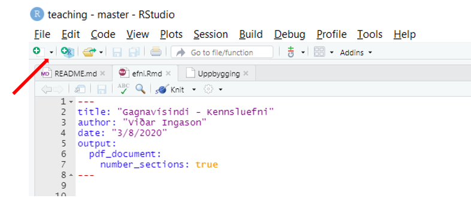
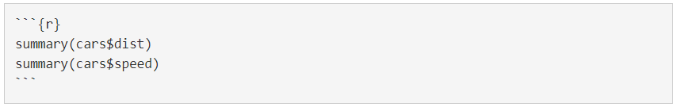
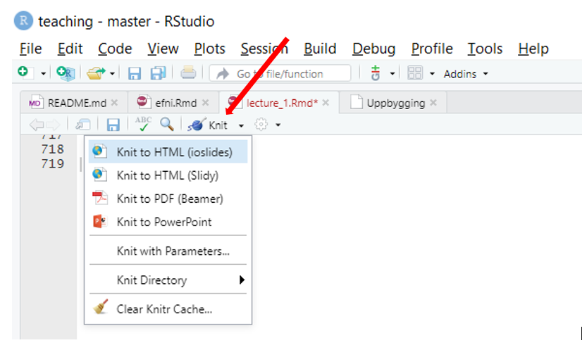

```{r setup, include=FALSE}

knitr::opts_chunk$set(echo = TRUE, message = FALSE, warning = FALSE)
library(tidyverse)
library(rprojroot)
library(knitr)

root <- is_rstudio_project

options(scipen = 999)
```

## Efni námskeiðsins

Efni námskeiðins skiptist í fjóra flokka eftir dögum.

1. Inngangur að R og RMarkdown
2. Gagnavinnsla með dplyr og tidyr pökkunum
3. Myndræn framsetning með ggplot2 pakkanum
4. Notkun stýrisetningar (if-else), for loop, tímasetja script og, ef tími gefst, helstu föll úr purrr pakkanum
5. Aukaefni ef tími gefst: Dashboard


## Hvað eru gagnavísindi?
Gagnavísindi (e. data science) snúast um að draga fram eins mikið af upplýsingum úr gögnum og hægt er.


Gagnavísindi sameina forritun og tölfræði. Stundum sagt að *data scientist* sé aðili sem er betri í forritun en tölfræðingur og betri í tölfræði en forritari.


Myndræn framsetning er einnig mjög stór þáttur gagnavísinda.


## Hvað þarf data scientist að kunna? {.centered}


## Af hverju gagnavísindi?
Gögn eru alls staðar í dag og varla hægt að finna fyrirtæki sem ekki er með safn af gögnum.  

Forrit eins og R, og allir pakkarnir sem í boði eru, auk reiknigetu tölva hefur leitt til þess
að nær hver sem er getur framkvæmt tiltölulega flókna útreikninga án þess að hafa bakgrunn í forritun.  


*Data scientist* raðaðist sem *Best job in America* fjögur ár í röð, 2016-2019 og í þriðja sæti árið 2020 (skv. Glassdoor)


## Af hverju R?
R er eitt vinsælasta forritið í gagnavísindum

Öflugt forrit með gríðarlega stórt samfélag sem nennir að aðstoða þig hvenær sem er  
- https://stackoverflow.com/  
- https://community.rstudio.com/

Gerir þér kleift að nota eitt og sama forritið í að hreinsa gögn, framkvæma útreikninga, búa til gröf, búa til tölfræðilíkön og að lokum að setja allt saman í skýrslu, glærur eða gagnvirkt vefforrit (interactive web application)

Þessar glærur eru t.d. búnar til í R. Einnig hægt að búa til power point. Förum yfir það seinna í námskeiðinu.


## R samfélagið
Til að læra nýja hluti er gott að fylgjast með því sem aðrir eru að gera.

Mikið af góðum upplýsingum að finna hér:

- https://www.r-bloggers.com/
- #rstats á twitter
- https://www.tidyverse.org/blog/
- https://www.r-exercises.com/


## R pakkar
Ein af ástæðum mikilla vinsælda R eru svokallaðir pakkar.
Í dag eru til yfir 15.000 pakkar fyrir R.  

R pakki er í raun safn af kóða sem búið er að skrifa til að framkvæma tiltekin verkefni.

dplyr og tidyr, hluti af tidyverse, eru t.d. pakkar notaðir við gagnavinnslu


```{r, eval=FALSE}
# Setja upp dplyr pakkann. Þetta er gert aðeins einusinni
install.packages("dplyr")

# Nota dplyr pakkann. Þetta er gert í hvert skipti sem þú opnar R og vilt nota dplyr
library(dplyr)

```


## Working directories og path
R vísar alltaf í einhverja möppu á tölvunni.

Til að finna hvar við erum staðsett er hægt að nota `getwd()`

Það er hægt að breyta um staðsetningu með `setwd()` en við viljum forðast það.

Búum til Project til að komast hjá því. Skoðum það á eftir.


## RStudio
Með RStudio er mun auðveldara að  

* Halda utan um verkefni (hættum að spá í `getwd()` og `setwd()`) 
* Búa til skýrslur og glærur  
* Nota Version Control líkt og git (sjá auka skjal sett inn á vefinn)  
* Tímasetja (e. schedule) R forrit  

Opnum núna RStudio


## Fyrsti tími - Inngangur að R
* Pakkar
* Útreikningar
* Breytur
* Tegund gagna/breyta
* Vector
* Kynning á föllum
* Missing values
* Pípur
* Data frame


## Pakkar
Fyrir þetta námskeið þurfum við að setja upp eftirfarandi pakka:

* tidyverse
* lubridate
* zoo
* anytime
* gapminder


## Útreikningar
R er sérhannað til að vinna með gögn og framkvæma útreikninga

```{r}
1 + 1

4 / 2

5 * 10
```


## Útreikningar
Hér gilda hefðbundnar reglur um forgangsröðun útreikninga þegar bæði er unnið með plús/mínus og margföldun/deiling

Hver er útkoman hér?
```{r}
2 + 2 * 4

5 / 5 + 1
```


## Breytur (e. variables)
Geyma safn upplýsinga sem hægt er að nota seinna

```{r}
x <- 10
x

y <- 1:10 # Eða seq(from = 1, to = 10, by = 1)
y
```


## Breytur, frh.
Nöfn geta innihaldið alla stafi, (.) og (_)
```{r}
x_1 <- 1:10
x_2 <- 11:20
```

Ef við viljum henda breytu notum við `remove` eða styttinguna `rm`

```{r, error=TRUE}
rm(x_2)
x_2
```


## Gagnategundir (e. data types)
Það eru fjórar megintegundir gagna í R (skammstöfun inní sviga)

* Numeric (dbl)
* Character (chr eða fct)
* Date (date)
* Logical (lgl)
  - TRUE eða FALSE


## Gagnategundir - Numeric{.smaller}
Numeric eru allar mögulegar tölur (Rauntölur úr stærðfræðinni)
```{r}
x <- 4
is.numeric(x)
class(x)

x <- "4"
is.numeric(x)
class(x)
```


## Gagnategundir - Character{.smaller}
Mikilvægar í allri gagnavinnslu. Tvær leiðir til að meðhöndla þær. Sem `character` eða sem `factor`.


```{r}
x <- "forritun"
x

y <- factor("forritun")
y

identical(x, y)
```
Munurinn á character og factor mikilvægur við tölfræðivinnslu.  


## Gagnategundir - Dagsetningar
Dagsetningar eru almennt erfiðar viðureignar. Til að búa til `Date` breytu notum við `as.Date`. Date geymir upplýsingar um fjölda daga frá 1. janúar 1970.
```{r}
date1 <- as.Date("2020-01-01") # ár-mánuður-dagur
as.numeric(date1)
```

Þannig getum við reiknað út lengd milli tveggja dagsetninga
```{r}
as.Date("2020-01-01") - as.Date("2019-12-01")
```


## Gagnategundir - Logicals
`logical` er leið til að vinna með gögn sem eru annaðhvort `TRUE` eða `FALSE`.
R lítur á TRUE sem 1 og FALSE sem 0.
```{r}
as.numeric(TRUE)
as.numeric(FALSE)

3 > 2
```

`T` og `F` virka einnig fyrir `TRUE` og `FALSE`. Athugið þó að true virka ekki.

## Vector
Vector er safn gilda sem öll eru af sömu tegund (t.d. `numeric`)
```{r}
x <- c(1, 5, 2, 10)
x

y <- c("karl", "kona", "kona", "karl")
y

z <- c(1, 2, "karl", "kona")
z
```

## Vector
Það sem gerir R að öflugu gagnaforriti er t.d. hvernig það vinnur með vectora

```{r}
x <- 1:10
x
x * 2
```


## Vector
Búið til vector af tölum og framkvæmið mismunandi útreikninga

(+, -, /, *, `sqrt()`, ^)

Þrjár leiðir til að búa til vector

```{r}
x <- 1:10
y <- seq(from = 1, to = 10,  by = 2)
z <- c(0, 1, 1, 2, 3, 5, 8, 13, 21)
```

Hvernig virkar það að framkvæmta útreikninga með tvo vectora, t.d. `x * y` (prófið einnig að hafa x
og y af mismunandi lengd)


## Vectorar - logicals{.smaller}
Getum notað <, >, >=, ... til að filter-a það sem við viljum úr vector
```{r}
x <- c(4, 3, 2, 1) # eða 4:1 eða seq(4, 1, 1), athugið þarf ekki að skrifa from, to, by
x > 2
x[c(TRUE, FALSE, TRUE, FALSE)]
x[x > 2]
```


## Vector
Fiktum nú aðeins með raunveruleg gögn

R hefur mörg innbyggð gagnasett. Eitt þeirra er `Nile`.

Til að vita hvað gagnasettið `Nile` geymir sláum við inn `?Nile`


## Factor vector
Factor breytur skipta einna mest máli þegar kemur að líkanagerð

```{r}
q <- c("Grunnskóli", "Framhaldsskóli", "Háskóli", "Framhaldsskóli", "Grunnskóli")
q_factor <- as.factor(q)
q_factor
```


## Missing data
Í R eru tvær tegundir af *missing data*, `NA` og `NULL`. 

```{r}
x <- c(1, 2, NA, 4, NA, 6)
is.na(x)

y <- c("karl", "kona", NA, "karl")
is.na(y)
```


## Missing data
`NA` hefur áhrif á útreikninga.
```{r}
mean(x)

mean(x, na.rm = TRUE)
```

Sama á við um önnur föll eins og `sd`, `min`, `max`.

Það fer eftir viðfangsefni en stundum hendum við út `NA` en við líkanagerð yrði frekar skoðað *imputation*. 

## Missing data
`NULL` er í raun **ekkert**. Stundum sagt að það sé ekki beint **missingness** heldur **nothingness**.

Getum ekki sett það í vector
```{r}
z <- c(1, NULL, 3)
z
```

## Pípur
Ný aðferð/hugmyndafræði um að kalla í föll í R er með pípu (e. pipe), táknað með `%>%` (ctrl+shift+m eða Cmd+Shift+m). Pípa (úr `magrittr` pakkanum) virkar
þannig að það sem er vinstra megin við pípuna fer sem fyrsta **input** í fallið hægra megin við pípuna.

```{r, message=FALSE}
library(magrittr)
x <- 1:10

# Base R
mean(x)

# "Nýja" leiðin
x %>% mean()
```


## Data frame
Vector-ar hafa sína "galla". Þ.e. þeir eru of einfaldir þar sem þeir geta aðeins geymt eina
tegund af gögnum. T.d. aðeins `numeric` eða aðeins `character`.

Data frame er eins og Excel skjal að því leitinu til að það er með dálka (columns) og raðir (rows)

Tölfræðilega séð er hver dálkur *breyta* og hver röð *athugun*.

R lítur í raun á data frame þannig að hver dálkur er í raun vector sem hver um sig er af sömu lengd


## Tvær leiðir til að búa til data frame{.smaller}
Takið eftir muninum á upplýsingunum sem þið fáið úr `data.frame()` annars vegar og `tibble()`  hins vegar
```{r}
df1 <- data.frame(a = c(2, 2 ,1), b = c("já", "nei", "já"))
df1

df2 <- tibble(a = c(3, 2, 1), b = c("já", "nei", "já"))
df2

```


## Data frame{.smaller}
Alla jafna lesum við gögn inn (t.d. úr CSV skrá) beint sem data frame.

Bý hér til gagnasett til að sýna dæmigerðan data frame

```{r, message=FALSE}
library(tidyverse)
df <- tibble(laun = seq(from = 300000, to = 900000, by = 100000),
             kyn = c("Karl", "Kona", "Karl", "Kona", "Karl", "Kona", "Karl"),
             starf = c("Lager", "Lager", "Móttaka", "Móttaka", "Móttaka", "Skrifstofa",
                       "Skrifstofa"),
             aldur = c(18, 18, 25, 25, 28, 33, 35),
             dagsetning = as.Date(rep(c("2020-01-01"), 7)),
             menntun = factor(c(rep("Grunnskóli", 2), rep("Framhaldsskóli", 3), rep("Háskóli", 2))))

df

```

## Data frame

```{r}
dim(df)

nrow(df)

ncol(df)

```

## Data frame
Með því einu að slá inn nafnið á gagnasetinu (hér **df**) þá prentast út fyrstu 10 raðirnar

Einnig fáum við tegund gagnana

* `dbl` = numeric
* `chr` = character
* `date` = dagsetning
* `fct` = factor

Til að sjá 20 efstu getum við notað `head(df, 20)`.

Til að sjá 15 neðstu getum við notað `tail(df, 15)`.


## Data frame{.smaller}
Á morgun munum við m.a. fara í gegnum það hvernig við skeitum saman tveimur gagnasettum

Til að það heppnist vel þarf oft að ganga úr skugga um að nöfn á dálkunum séu rétt


```{r}
names(df)

names(df) <- c("einn", "tveir", "þrír", "fjórir", "fimm", "sex")
df

```

## Data frame{.smaller}
Getum einnig breytt nafni á aðeins einum dálki
```{r}
names(df)[4] <- "FJÓRIR"
head(df,2)
```

Eða breytt nafninu á tveimur
```{r}
names(df)[c(1, 5)] <- c("EINN", "FIMM")
head(df, 2)
```


## Data frame{.smaller}
Innbyggt í R er fall til að sjá uppbyggingu gagnasetts

`str` birtir *internal structure* gagnasettsins

```{r}
str(iris)
```


## Data frame{.smaller}
R er einnig með góða leið til að fá helstu tölfræðilegu upplýsingar úr gagnasetti með fallinu `summary`
```{r}
summary(df)

# Breyti aftur nöfnum á gagnasettinu
names(df) <- c("laun", "kyn", "starf", "aldur", "dagsetning", "menntun")
```


## Data frame
Ef við viljum skoða sérstaklega einn dálk í gagnasettinu, t.d. laun, þá getum við sótt
viðkomandi dálk með  `$` merkinu, **nafni** eða **númeri** dálks. Ef við viljum sækja dálkinn
með launum eða laun og menntun er eftirfarandi leiðir færar.

```{r, eval = FALSE}

# Með $
df$laun

# Með númer dálks
df[,1]
df[, c(1, 5)]

# Með nafni dálks og []
df[, "laun"]
df[, c("laun", "menntun")]
```


## Data frame
Það er ekki eins algengt að við viljum velja ákveðnar raðir

Það er þó einfalt

```{r}
df[1:4, ]
```


## Lestur gagna
Það er sjaldnast þannig að við erum að vinna með gögn sem við sláum sjálf inn.

Alla jafna erum við með gögn geymd í **CSV**, **Excel** eða gagnagrunni.

Gögn eru einnig á netinu. Annað hvort sem töflur á vefsíðu sem við viljum eða hlekkur (URL)
á gögn sem við viljum sækja.


## Lestur gagna
R er með innbyggð föll til að lesa inn gögn. T.d. `read.csv` fyrir **csv** skrár.

Eins og með margt annað er búið að búa til pakka sem auðvelda lestur gagna

Tveir mikilvægir pakkar til að lesa inn gögn eru **readr** (hluti af **tidyverse**) og  **readxl**


## Lestur gagna - csv{.smaller}
```{r}
mbl <- read_csv("mbl_gagnasett.csv")
```

Getum litið á gagnasettið með því að slá inn nafnið í Console
```{r}
mbl
```


## Lestur gagna - Excel{.smaller}
Ef við ætlum aðeins að nota `readxl` pakkan einsuinni, þ.e. til að lesa inn skjalið, getum við sleppt því að hlaða honum inn með `library` fallinu og vitnað frekar í fall í pakkanum með ::
```{r}
fake_pizza <- readxl::read_excel("Fake Pizza Data.xlsx")
fake_pizza
```

## Lestur gagna - Excel
Stundum erum við með Excel skjal sem hefur mörg Sheet

Við getum lesið gögn inn eftir númeri á sheet-i eða nafni

```{r, eval = FALSE}
library(readxl)
gogn <- read_excel("gogn.xlsx", sheet = 2)
gogn <- read_excel("gogn.xlsx", sheet = "Mannfjoldi")
```


## Lestur gagna - Bandaríkin vs. Evrópa{.smaller}

Í Evrópu er algengt að ; sé notuð frekar en , til að skipta upp í dálka. `read_csv` notar hins vegar ,

Sæki gögn af Hagstofunni
```{r}
visitala_slod <- "https://px.hagstofa.is:443/pxis/sq/33e56e8b-e324-4928-9877-aa0022906fdc"
vnv1 <- read_csv(visitala_slod)
vnv1
```

## Lestur gagna - Bandaríkin vs. Evrópa{.smaller}
Lausnin er að nota `read_csv2` sem notar ; til að skipta upp í dálka
```{r}
vnv2 <- read_csv2(visitala_slod)
head(vnv2, 3)
```


## Lestur gagna - Kóðun (e. encoding){.smaller}
Hér erum við komin í frekar flókið viðfangsefni.  
Lendum stundum í vandræðum með kóðun gagna og íslenska stafi

```{r}
vnv3 <- read_csv2(visitala_slod, locale = locale(encoding = "latin1"))
head(vnv3, 3)
```

## Lestur stórra gagna
Gögnin sem við höfum lesið inn hér að framan eru mjög lítil

Það er ekki óalgengt að gögn séu nokkur hundruð MB eða jafnvel nokkur GB.

`read_csv` er hratt en það eru til leiðir sem eru enn sneggri að lesa inn gögn

`vroom` fallið í **vroom** pakkanum er mjög hratt

```{r, eval = FALSE}
library(vroom)
stor_gogn <- vroom("stor_gogn.csv")
```


## Lestur gagna úr gagnagrunnum
Gögn eru oft geymd í gagnagrunnum

Auðvelt að lesa gögn beint úr gagnagrunni inn í R

Getur verið mikið vesen í upphafi að koma á tengingu við gagnagrunn.
Best er að fá aðstöð frá tölvusérfræðingi fyrirtækisins.

Á https://db.rstudio.com/ eru allar upplýsingar sem þarf til að tengjast þeim gagnagrunni
sem er notaður í ykkar fyrirtæki/stofnun.

## Lestur gagna úr gagnagrunnum{.smaller}
Eftir að búið er að koma á tengingu við gagnagrunninn
```{r, eval=FALSE}
con <- DBI::dbConnect(odbc::odbc(),
                      Driver   = "[your driver's name]",
                      Server   = "[your server's path]",
                      UID      = rstudioapi::askForPassword("Database user"),
                      PWD      = rstudioapi::askForPassword("Database password"),
                      Port     = 3306)
```


Viljum sækja gagnasettið *felagatal*. Notum `tbl` fallið til þess.
```{r, eval=FALSE}
felagatal <- tbl(con, "felagatal")
```


Ef felagatal er mjög stórt gagnasett þá get ég valið hvað ég vil áður en ég endanlega sæki gögnin inn í R
```{r,eval=FALSE}
felagatal <- tbl(con, "felagatal") %>% select(kennitala, laun, aldur) %>% filter(aldur > 45) %>% collect()
```


## Búa til eigin föll
Höfum notað nokkur innbyggði föll í R fram að þessu.

`mean`, `dim`, `nrow`, `sum` og fleiri

Stundum kemur fyrir að það eru ekki til föll fyrir það sem við viljum reikna

Föll eru mikilvæg þegar kemur að því að reikna eitthvað aftur og aftur

```{r}
# x er kallað input eða argument í fallið
margf_1 <- function(x) {
  x * 2
}

margf_1(4)
```

## Búa til eigin föll
Getum haft eins mörg *input* og við viljum. Notum `paste` fallið til að skeita saman texta og útkomunni

```{r}
margf_2 <- function(x, y) {
  m <- x * y
  paste("Útkoman er", m)
}

margf_2(x = 2, y = 6)

```

Athugið að það sem við búum til inní fallinu, breytan **m** hérna, er ekki hægt að nota fyrir utan fallið.


## Föll - Hverju skilar fallið?{.smaller}
Við tölum um *return value* í falli. Þ.e. hverju skilar fallið til okkar.

Á glærunni á undan var *return value* seinasta línan í fallinu.

Til að það fari ekki milli mála hverju fallið á að skila er gott að nota `return` skipunina
```{r}
margf_3 <- function(x, y) {
  m <- x * y
  utkoma <- paste("Útkoman er", m)
  
  return(utkoma)
  
  # Fallið hættir eftir return() og mun ekki keyra það sem er er fyrir aftan
  x * 3
  
}

margf_3(5, 6)
```


## Búa til eigin föll{.smaller}

```{r, warning=FALSE}

grunnfjarhaed <- c(389520, 515172, 603132, 653388)
fritekjumork <- c(4020975, 5318065, 6226026, 6744861)
  
husnaedisbaetur <- function(fjoldi, tekjur, eignir = 0, leiga) {
  grunnur <- grunnfjarhaed[fjoldi]
  mork <- fritekjumork[fjoldi]
  skerding <- ifelse(tekjur * 12 > mork, 0.11*(tekjur*12 - mork), 0)
  baetur <- (grunnur - skerding)/12
  baetur_final <- ifelse(baetur > 0.75*leiga, 0.75*leiga, baetur)
  baetur_pretty <- paste(prettyNum(round(baetur_final, 0), big.mark = "."), "kr.")
  
  return(baetur_pretty)
}

husnaedisbaetur(fjoldi = 1, tekjur = 520000, leiga = 180000)

```


# RMarkdown

## R Markdown
R Markdown er tól inní RStudio til að búa til skrýslur, kynningar, heimasíður eða lifandi mælaborð.

Það sem gerir RMardown svona öflugt er að það býður uppá að skrifa texta og R kóða á sama stað

Þessar glærur eru búnar til með R Markdown (ioslides_presentation)


## RMarkdown
Til að búa til RMarkdown skjal veljum við græna plúsinn uppí vinstra horninu
  
[R Markdown Cheat Sheet](https://rstudio.com/wp-content/uploads/2015/02/rmarkdown-cheatsheet.pdf)


## RMarkdown - YAML{.smaller} 

title: "Kynning á Project A"  
author: "Hagdeild"  
date: "Október 2020"  
output: pdf_document  

Skýrslur:  

- *pdf_document*
- *html_document*
- *word_document*  

Kynningar:

- *powerpoint_presentation*
- *ioslides_presentation*
- *beamer_presentatin*


## RMarkdown - YAML - Efnisyfirlit
PDF skjal:

```{r, eval = FALSE}
output:
  pdf_document:
    toc: true
    number_sections: true
```

HTML skjal:

```{r, eval = FALSE}
output:
  html_document:
    toc: true
    toc_float: true
```

## R Code Chunk
Shortcut til að búa til code chunk: Alt + Ctrl + i (Cmd + Option + i)




## RMarkdown - Texti
`*skáletrað*` -> *skáletrað*

`**feitletrað**` -> **feitletrað**

`***feit- og skáletrað**` -> ***feit- og skáletrað***

`[MBL](www.mbl.is)` -> [MBL](http://www.mbl.is)

## RMarkdown - Header
Til að búa til kafla (headings) notum við (#)

Stærð kaflaheitis er stjórnað með fjölda (#). RMarkdown notar þetta til að númera
kafla rétt og birta í efnisyfirliti.

```{r}
# Header 1
## Header 2
### Header 3
#### Header 4
```

## test
1. Item 1
2. Item 2
3. Item 3
    + Item 3a
    + Item 3b

* Item 1
* Item 2
    + Item 2a
    + Item 2b

## RMarkdown - Listi
Búum til lista með því að nota (-) eða (*).  
Sub-item er búið til með því að nota tvö tab

```{r, eval=FALSE}
- Item
    - Sub-item
- Item
- Item
```

- Item
    - Sub-item
- Item
- Item

## RMarkdown - Texti
Búum til númeraðan lista með því að nota tölustaf og punkt (tvö tab fyrir sub-item)
```{r, eval = FALSE}
1. Item 1
2. Item 2
3. Item 3
    - Item 3a
    - Item 3b
```


1. Item 1
2. Item 2
3. Item 3
    - Item 3a
    - Item 3b


## R Code Chunk options{.smaller}

- `echo = FALSE`  
birtir niðurstöður en ekki kóðann

- `message = FALSE`  
kemur í veg fyrir skilaboð birtist í niðurstöðum

- `warning = FALSE`  
kemur í veg fyrir að viðvaranir birtist í niðurstöðum

- `eval = TRUE`  
segir til um hvort keyra eigi kóðan og birta niðurstöðurnar eða ekki. Gott
fyrir kennslu til að sýna kóðan án þess að hann keyri.

- `include = FALSE`  
kemur í veg fyrir að kóðin eða niðurstaðan birtist í skýrslunni en hægt að nota
niðurstöðuna annars staðar

- `cache = TRUE`  
Ef útreikningar í skjalinu taka mjög langan tíma er hægt að geyma þá. Þannig þarf
R ekki að reikna allt aftur ef þú keyrir aftur skjalið


## R Code chunk options
fig.height og fig.width stjórna hæð og breitt mynda í tommum

Sjálfvalið er fig.height = 5 og fig.width = 7

Hægt að breyta í hverju code chunk-i fyrir sig eða fyrir allt skjalið með því að setja viðeigandi
fig.height / fig.width inn í `knitr::opts_chunk$set` efst í kjalinu. 

```{r, eval=FALSE}
knitr::opts_chunk$set(echo = FALSE, message = FALSE, warning = FALSE,
                      fig.height = 7, fig.width = 8)
```


## RMarkdown inline code
Með R Markdown er hægt að nota inline code. Það þýðir að hægt er að vitna í niðurstöður útreiknina í texta
```{r}
dags_idag <- lubridate::today() # today() er fall úr lubridate pakkanum
jol <- as.Date("2020-12-24")
dagar_til_jola <- jol - dags_idag
```

Til að vitna í niðurstöður notum við `` `r
dagar_til_jola` ``.

Til að fá kommurnar: AltGr + `

Í dag eru `r dagar_til_jola` dagar til jóla


## RMarkdown - Búa til skjalið
Til að búa til skjalið ýtum við á Knit takkann. Einnig hægt að velja þríhyrningin og velja annað form.




## Töflur í R markdown skjölum{.smaller}

Til að birta töflur í R markdown skjölum notum við **knitr** og **kableExtra** pakkana

```{r}
mtcars %>%
  head(3) %>%
  kable() # kable() er fall úr knitr pakkanum

```


[Ítarefni fyrir PDF skjöl](http://haozhu233.github.io/kableExtra/awesome_table_in_pdf.pdf)

[Ítarefni fyrir HTML skjöl](https://cran.r-project.org/web/packages/kableExtra/vignettes/awesome_table_in_html.html)
