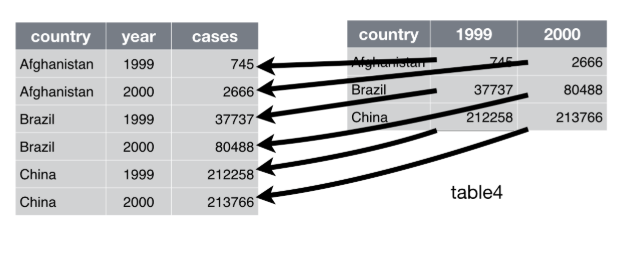
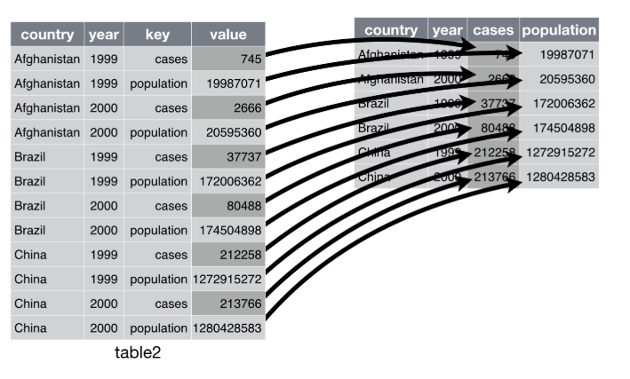

```{r setup, include=FALSE}
knitr::opts_chunk$set(echo = TRUE, message = FALSE, warning = FALSE)
library(tidyverse)
library(rprojroot)

root <- is_rstudio_project

options(scipen = 999)
```


##  Gagnagreining
Í þessum tíma munum við kynnast nokkrum pökkum sem munu gera alla gagnagreiningu mun auðveldari.

Munum nota **dplyr** pakkann mjög mikið auk **tidyr**.

Ofangreindir pakkar eru báðir hluti af því sem heitir **tidyverse** (https://www.tidyverse.org/)

Nóg að hlaða in **tidyverse** með `library(tidyverse)`.


## dplyr{.smaller}
dplyr pakkinn er öflugasti pakkinn í R til að vinna með gögn

Virkar aðeins á **data frame** (enda mest notaðasta data structure í R)

- `filter()` velur raðir úr gagnasettinu út frá gildum
- `mutate()` býr til nýja breytu og bætir við gagnasettið
- `select()` velur breytu(r) úr gagnasettinu
- `summarise()` dregur saman upplýsingar í eina tölu
- `arrange()` breytir röðun gagnasettisins

Hægt er að nota öll föllin að ofna með `group_by()` til að framkvæma útreikninga niður á hópa

Öll föllin að ofan er einnig hægt að nota til að vinna beint með gögn í gagnagrunni. Einungis
þarf að setja upp **dbplyr** pakkann. Með þessu geti þið unnið í gagnagrunni án þess að 
kunna SQL.

## tidyr
Það er sagt að 80% af tíma gagnagreinanda fari í að hreinsa og vinna gögnin.

Grunnhugmyndin er að tidy gagnasetti er að:

- hver breyta er dálkur
- hver athugun býr til eina röð

**tidyr** pakkinn er gríðarlega hjálplegur í hreinsun gagna

Við load-um yfirleitt **tidyverse** pakkanum sem inniheldur m.a. þessa tvo pakka.


## Gagnavinnsla með dplyr
Í gagnavinnslu er mjög mikilvægt að þú áttir þig á því hvað þú vilt gera. Þ.e. vitir nokkurn
veginn hver niðurstaðan eigi að vera.

Til að læra almennilega á dplyr er nauðsynlegt að vinna með gagnasett.

Hér munum við nota gagnasett um íbúðir auglýstar á fasteignavef MBL

## mbl gagnasettið{.smaller}

```{r}

mbl <- read_csv("mbl_gagnasett.csv")
str(mbl, give.attr = FALSE)

```


## Læra inn á gögnin
Áður en greining hefst er gott að fá tilfinningu fyrir gögnunum

Ein góð leið er að nota **gogn %>% count(breyta)** ef um categorical breytu er að ræða

Fyrir númerískar breytur virkar `summary()` fallið vel.

Skoðum mbl gagnasettið


## Veljum raðir með `filter`{.smaller}
Veljum raðir úr gagnasettinu með `filter()`.

Gott að vita

- `&` notað fyrir **og**
- `|`  notað fyrir **eða**
    - AltGr og "< > |" takkinn milli Shift og Z á Windows og Shift+Alt+L eða Alt + 7 (Alt takkinn til hægri) á Mac
- `<` notað fyrir **minna en**
- `>` notað fyrir **stærra en**
- `<=` notað fyrir **minna en eða jafnt og**
- `>=` notað fyrir **stærra en eða jafnt og**
- `==` notað fyrir **jafnt og**
- `!=` notað fyrir **ekki jafnt og**

Allt að ofan á við um ef filter-að er eftir einu gildi. Ef við viljum filter-a eftir mörgum
gildum má nota `%in%`

```{r, eval=FALSE}
gogn %>% filter(aldurshopur %in% c("25-34 ára", "35-44 ára"))
```


## `slice`
`filter()` er notað til að velja raðir út frá *logical expression*.

`slice()` er notað til að velja raðir út frá númeri raðar

```{r}
mtcars %>% slice(10:15)
```


## Búa til nýja breytu með `mutate()` fallinu
Ef við viljum búa til nýja breytu notum við `mutate()` fallið. 

```{r}
mbl %>% 
  select(Verd, Size) %>% 
  mutate(fermetraverd = Verd/Size) %>% 
  head(5)
```

## Nýtt gagnasett
Oft viljum við búa til nýtt gagnasett eftir að hafa hafa notað `filter()` eða `mutate()`

```{r}
mbl_nytt <- mbl %>% 
  filter(Verd > 150000000) %>% 
  mutate(fermetraverd = Verd / Size)
```


## Nú er komið að ykkur
Notum mbl gagnasettið til að framkvæma eftirfarandi:

- Veljið allar eignir í Kópavogi sem eru verðlagðar undir fasteignamati
- Veljið allar eignir sem eru ekki í Reykjavík, Kópavogi, Mosfellsbæ, Garðabæ eða Hafnarfirði og
eru með byggingarár 2019. Reiknði svo út hversu margar eignir þetta eru með `count()` fallinu.
  - Hint: Bætið `count()` aftast í pípuna.
- Búum til nýja breytu sem sýnir verð sem hlutfall af meðalverði fyrir fjölbýli og
veljum þær eignir sem eru meira en 50% dýrari en meðaltalið. Notum aðeins fjölbýli í Reykjavík.


## Velja breytur úr gagnasetti með `select`
Það er mjög algengt að vera með töluvert fleiri breytur í gagnasettinu en þú þarft að nota

Til þess notum við `select()` fallið í dplyr.

Getum valið breytur eftir:

- Nafni
- Á hverju nafnið byrjar á með `starts_with()`
- Á hverju nafnið endar á með `ends_with()`
- Hvort nafnið innihalda tiltekna samsetningu stafa með `contains()`
- Tölulegri staðsetningu dálks


## Endurraða gagnasetti með `arrange`
`arrange()` er notað til að raða breytum

```{r, eval = FALSE}
df <- tibble(x = c("A", "B", "A", "B", "B", "C", "A", "C"),
             y = c(3, 2, 1, 1, 3, 2, 2, 1))

# Raða í stafrófsröð
df %>% 
  arrange(x)

# Raða í öfuga stafrófsröð með desc (descending)
df %>% 
  arrange(desc(x))

# Rað eftir tveimur breytum, önnur frá hæsta til lægsta gildi
df %>% 
  arrange(x, desc(y))

```


## summarise
`summarise()` er notað til að draga saman upplýsingar í eina tölu

```{r}
mbl %>%
  filter(Stadur %in% c("Reykjavík", "Mosfellsbæ", "Kópavogi")) %>% 
  group_by(Stadur) %>%
  summarise(medalverd = mean(Verd, na.rm = TRUE))
```


## summarise
Í nýjustu útgáfu af dplyr (1.0.0) er hægt að nota `summarise()` þó niðurstaðan sé ekki ein tala.

Ef við viljum vita hæsta og lægsta verðið fyrir hvert stað líkt og að ofan notum við `range()`.
```{r}
mbl %>% 
  filter(Stadur %in% c("Reykjavík", "Mosfellsbæ", "Kópavogi")) %>% 
  group_by(Stadur) %>%
  summarise(medalverd = range(Verd, na.rm = TRUE))
```

Þetta var ekki hægt með `summarise()` fallinu fyrr en í júní á þessu ári.


## Window functions
Svokölluð window functions taka in **n** gildi og skila **n** gildum. Ólíkt t.d. `sum` sem tekur inn **n** gildi en skilar einu

Helstu föllin eru:

- `lag()`
- `lead()`
- `cumsum()`
- `min_rank()`

## Pivot með **tidyr** pakkanum - `pivot_longer()`{.smaller}
```{r, eval = FALSE}
data %>% 
  pivot_longer(cols = 2:3,
               names_to = "year",
               values_to = "cases")
```




## Pivot með **tidyr** pakkanum - pivot_wider(){.smaller}
```{r, eval = FALSE}
data %>% 
  pivot_wider(names_from = key,
              values_from = value)
```




## Nú þið
Notið gapminder gagnasettið í gapminder pakkanum

- Fyrir hvert land, finnið það ár þar sem væntur lífaldur (lifeExp) var hæstur
- Finnið þau lönd þar sem lifeExp er hærra en 60 og gdpPercap er yfir 30.000
- Finnið öll lönd sem innihalda strenginn *land*

Skiptum yfir í mbl gagnasettið

- Finnið út fyrir hvern stað hvaða byggingarár er með hæsta meðalfermetraverðið fyrir fjölbýli
og raðið niðurstöðunum í röð frá hæsta meðalfermetraverði niður í lægsta meðalfermetraverð.

- Finnið tvö dýrustu einbýlishúsin í Reykjavík, Mosfellsbæ og Kópavogi


## Skeita saman tveimur gagnasettum
Helsta fallið til að skeita saman tveimur gagnasettum er `left_join()`

`left_join()` svipar til **vlookup** í Excel


## Skeita saman tveimur gagnasettum

```{r}
df1 <- tibble(x = c("A", "B", "C", "D"),
              y = c(1, 4, 2, 5))

df2 <- tibble(x = c("B", "A", "D", "C"),
              z = c(9, 7, 2, 5))

df1 %>% left_join(df2)
```


## Skeita saman tveimur gagnasettum
Á glærunni á undan gekk þetta smurt fyrir sig þar sem bæði gagnasettin innihéldu breytu sem heitir x

Það kemur fyrir að við viljum skeita saman tveimur gagnasettum en nöfn breytanna eru ekki þau sömu

```{r}
names(df2)[1] <- "m"

df1 %>% left_join(df2, by = c("x" = "m"))
```


## Unnið með texta
Líkt og kom fram í gær vinnum við oft með texta (character data).

Mikilvægasta fallið er `paste()` og `paste0()`.

```{r}
paste("Góðan", "daginn", sep = " ") # sep = " " er default og þarf ekki að taka fram
paste("Góðan", "daginn", sep = "-")
paste0("Góðan", "daginn")
```


## Unnið með texta
Fjölluðum einnig um í gær að dagsetningar valda oft veseni

Lausn er að skrifa dagsetningu sem tölu, t.d. Ár-Mánuður-Dagur. 16. apríl 2020 yrði því 20200416

```{r}
df <- tibble(dags = c("20190204", "20200312", "20211002"))

# Árin
str_sub(df$dags, start = 1, end = 4)

# Mánuðirnir
str_sub(df$dags, start = 5, end = 6)
```


## Unnið með texta
Ef við viljum finna allar raðir í gagnasetti sem innihalda tiltekið orð: `str_detect()`
```{r}
trump <- dslabs::trump_tweets %>% select(text)
cat(str_wrap(trump$text[100], width = 60), "\n")

# Gefur TRUE FALSE vector sem við getum notað sum() á
trump_word <- str_detect(trump$text, "proud")

sum(trump_word)
```


# Hreinsun gagna


## Hreinsun gaga
Gögn eru oft ekki tilbúin til greiningar. Laga þarf dálka, breyta þarf gildum, skeita saman gagnasettum o.s.frv.

Við erum búin að fara yfir atriði eins og að skeita samana gagnasettum. Stundum er þó viðkomandi gagnasett ekk tilbúið.

Dæmi gæti verið dálkur sem nýtist betur ef honum er skipt upp í tvo dálka (`separate()` fallið í **tidyr**)

Annað dæmi er þegar tveir dálkar eru betur nýtt ef þeim er skeitt saman (`unite()`) fallið í **tidyr**)


## `unite()` úr tidyr
`unite()` er fall til að sameina dálka

```{r}
df <- tibble(rikisfang = c("Erlent", "Íslenskt", "Erlent"),
             kyn = c("Karl", "Kona", "Karl"))
df1 <- df %>% 
  unite("kyn_rifa", kyn:rikisfang)

df1
```


## `separate()` úr tidyr
`separate()` er fall til að skipta upp dálkum í gagnasetti.  
```{r}
df1 %>% 
  separate(col = kyn_rifa, into = c("x", "y"), sep = "_")
```

Athugið að almennt þarf ekki að skilgreina sep. `separate()` finnur út eftir hverju á að aðskilja.

Prófi að nota fallið að ofan án sep = "_".


## Breyta texta{.smaller}
Gagnasett geta verið með texta sem við viljum breyta

```{r, echo=FALSE}
df <- tibble(atvinnugrein = c(rep("Heild- og smásöluverslun, viðgerðir á vélknúnum ökutækjum", 3),
                              rep("Leigustarfsemi og ýmis sérhæfð þjónusta", 3)))
```

```{r}
df
```

Hér myndum við eflaust vilja breyta nöfnunum t.d. til að stytta þau


## Breyta texta

```{r}
df$atvinnugrein <- recode(df$atvinnugrein,
                          "Heild- og smásöluverslun, viðgerðir á vélknúnum ökutækjum" = "Heild- og smásöluverslun",
                          "Leigustarfsemi og ýmis sérhæfð þjónusta" = "Leigustarfsemi")
```


## Breyta texta
Stundum viljum við finna tiltekið orð og skipta því út


