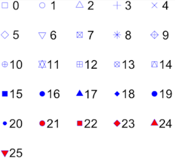

```{r setup, include=FALSE}
knitr::opts_chunk$set(echo = TRUE)

library(tidyverse)
library(rprojroot)

root <- is_rstudio_project

options(scipen = 999)
```


## Inngangur - Mismunandi framsetning{.smaller}
Gögn má setja fram á marga mismunandi vegu. 

Helstu framsetingar eru eftirfarandi:

- **Scatter plot**: Notað til að sýna samband tveggja breyta
- **histogram**: Notað til að sýna dreifingu breytu
- **boxplot**: Notað til að sýna dreifingu breytu með miðgildi og fjórðungsmörkum
- **line graphs**: Notað til að sýna þróun tiltekinna breytu (oftast yfir tíma)
- **bar plot**: Notað til að bera saman t.d. hlutföll

Bók til að fá hugmyndir af því hvernig eigi, og eigi ekki, að setja gögn
fram með myndrænum hætti. https://serialmentor.com/dataviz/  

Cheat-sheet hér: https://rstudio.com/wp-content/uploads/2015/03/ggplot2-cheatsheet.pdf  

Síða með hugmynum og kóða: https://www.r-graph-gallery.com/

## ggplot2 pakkinn
**ggplot2** er mest notaðasti og öflugasti pakkinn í R fyrir tölfræðilega myndvinnslu

`ggplot()` fallið alltaf notað í grunninn. Þar skilgreinum við gagnasettið og breyturnar sem við
viljum nota í grafið

Síðan byggjum við ofan á þetta með svokölluðum leyers

Opnum RStudio og tökum dæmi


## Grammar of graphics
Grunnhugmyndin er að skilgreina hverja **einingu myndar/grafs** og síðan sameina þær í nánast
hvaða graf sem þér dettur í hug.

Einingarnar eru eftirfarandi:

- data
- aesthetic mapping (x, y, color)
- geometric object (line, boxplot, barplot, histogram, ...)
- statistical transformation (ecdf, ...)
- scales (control how data are translated to visual properties)
- coordinate system ("zoom", flip, ...)
- position adjustments (dodge, jitter)
- faceting


## Base R plot
Það þarf ekki auka pakka, líkt og **ggplot2** til að búa til gröf inní R

`plot()`, `hist()` og `boxplot()` eru dæmi um innbyggð föll til að búa til gröf

Það er fínt að þekkja  base plot en almennt betra að ná tökum á **ggplot** sem fyrst

Opnum RStudio og kíkjum aðeins á base R


## Lögun `geom_point()` {.smaller}

`geom_point()` er með sjálfvaldið litla svarta hringi. Getum breytt þessu með **pch**
argument-inu inní `aes()` fallinu.



- 0-14 eru hol og **color** stjórnar litnum á jaðrinum
- 15-20 eru fyllt og **color** stjórnar litnum á fyllingunni
- 21-25 eru fyll og með jaðri. **color** stjórna litnum á jaðrinum, **fill** stjórnar litnum á
fyllingunni


## faceting
Stundum viljum við nota töluvert mikið af upplýsingum á sama tíma. Því fleiri upplýsingar því
meiri troðningur verðu á grafinu og það því óskýrara.

Ein af lausnunum er að nota faceting. `facet_wrap()` og `facet_grid()`. 

Opnum Rstudio

## Dreifingar
Histogram er mjög góð leið til að skoða dreifingar.

Fleiri leiðir sem innihalda meiri tölfræði geta einnig verið gagnlegar, sérstaklega þegar við
eru að skoða dreifingar milli hópa

Tvær mismunandi framsetningar eru

- Boxplot
- Violin plot

Opnum R


## Theme
Grunn theme-ið í ggplot er grár bakgrunnur, hvítar grid lines

Hægt er að breyta útlitinu með theme_*

Hægt að velja um nokkur themes í ggplot. Fleiri themes til í **ggthemes** pakkanum

Opnum RStudio


## Vista gröf{.smaller}
Það er ekki endilega alltaf þannig að við erum að vinna með RMarkdown. Stundum viljum við
bara búa til eitt graf og senda það t.d. á samstarfsfélaga.

Til að vista graf er hægt að velja Export í Plots flipanum. Þar eru þrír valmöguleikar

Þægilegri leið er að nota `ggsave` fallið

`ggsave()` vistar seinasta grafið sem var búið til

Getum stjórnar hæð og breidd með *height* og *width* argument-unum

*dpi* stjórnar upplausninni


## Lifandi gröf
Í html skjölum (html_documents eða ioslides_presentation) er hægt að vera með lifandi gröf

**plotly** pakkinn býr til lifandi gröf: https://plotly.com/r/

```{r, eval=FALSE}
g <- ggplot(mpg,
            aes(x = displ,
                y = hwy)) + 
  geom_point()

plotly::ggplotly(g)
```

## Lifandi gröf{.smaller}
```{r, echo=FALSE}
g <- ggplot(mpg,
            aes(x = displ,
                y = hwy)) + 
  geom_point()

plotly::ggplotly(g)

```


## Verkefni{.centered}
Reynum að búa til þessa mynd frá The Economist með ggplot


## Verkefni

1. Búið til scatter plot með CPI á x-ásnum og HDI á y-ásnum
2. Gefið punktunum lit eftir region