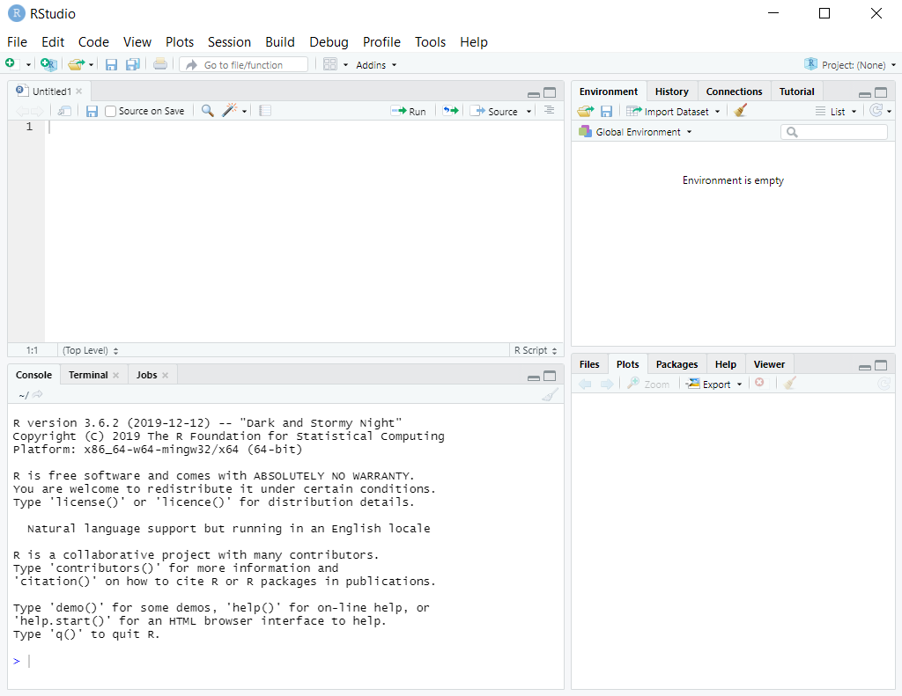
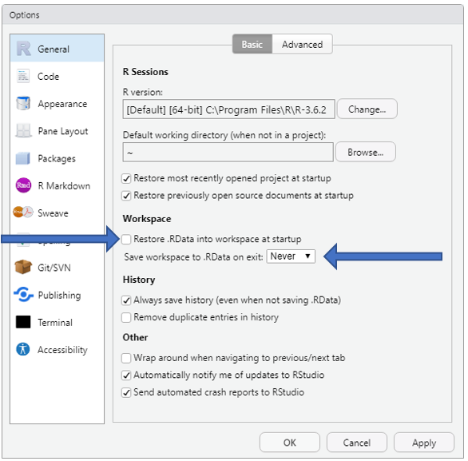

```{r setup, include=FALSE}
knitr::opts_chunk$set(echo = TRUE)

library(rprojroot)

root <- is_rstudio_project
```


# R og RStudio
Það er auðvelt að ruglast á muninum á R og RStudio. Þegar talað er um að forrita í R opna í raun allir RStudio. Hugsa má R sem vélina í bíl og RStudio sem stýrið og mælaborðið í bílnum.  


# Uppsetning á R
Til að setja upp R ferðu inn á https://cloud.r-project.org/  

## Fyrir Windows notendur
1. Smelltu á Download R for Windows
2. Smelltu á \textcolor{blue}{base} uppí vinstra horningu
3. Veldu Download R 3.x.x for Windows (nú 3.6.3)


## Fyrir Mac
1. Smelltu á Download R for (Max) OS X
2. Undir **Latest release:**, veldu R-3.x.x.pkg (nú 3.6.2)

Eftir að hafa sett upp R á tölvunni þinni þarftu í raun ekki að spá mikið meira í R sem slíku.  


# Uppsetning á RStudio
RStudio er viðmótið sem nær allir R notendur nota.  
Sækið RStudio inná https://rstudio.com/products/rstudio/download/#download  

Undir **All Installers** finnið þið þá útgáfu sem á við ykkar tölvu.  

Windows notendur sækja RStudio-1.2.xxx.exe (nú 1.2.5033.exe)  
Mac notendur sækja RStudio-1.2.xxx.dmg (nú 1.2.5033.dmg)

Efti að hafa sett upp RStudio smellið þið á RStudio logið  

  

og þá birtist ykkur þessi gluggi   


Það seinasta sem ég vil biðja ykkur um að gera er að breyta tveimur stillingum inní RStudio. Opnið RStudio og velijð **Tools** í stikunni uppi og **Global Options...**. Stillið líkt og sýnt er á myndinni að neðan.  

